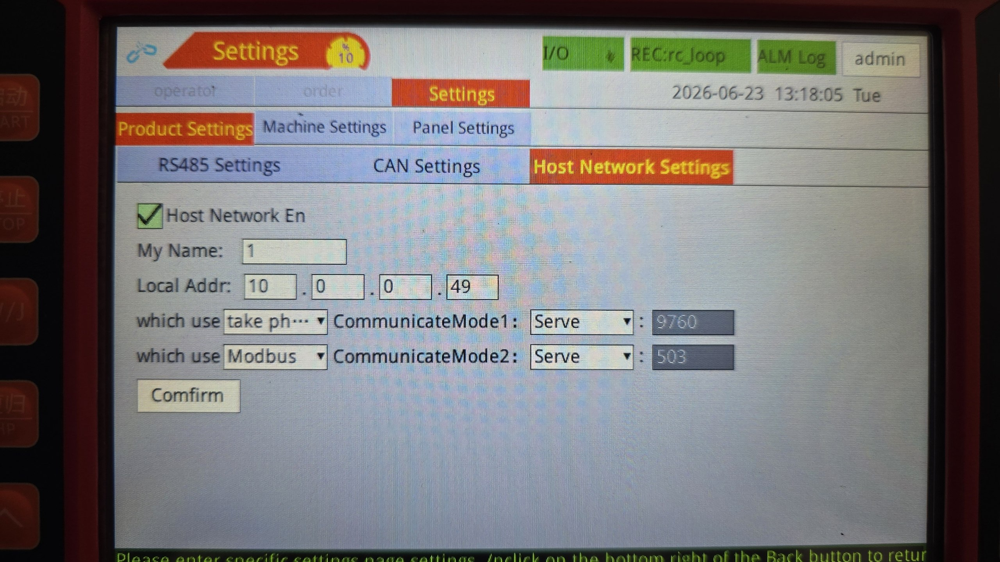
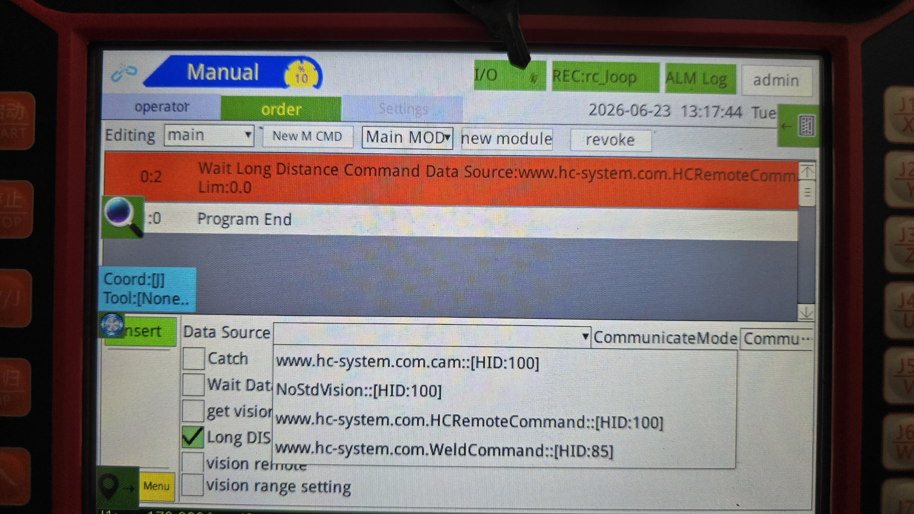
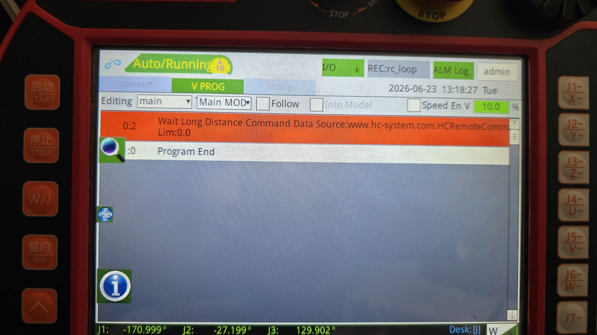

# borunte-pc-rc

**Real-time PC remote control of the Borunte BRTIRUS0707A 6-axis robot arm via Python.**

Confirmed working on firmware `HC-QC-RX-7.8.07-master-F5.2.1`. No external Python libraries required — stdlib only.


---

## How it works

```
┌─────────────┐   TCP/JSON    ┌───────────────────────┐
│     PC      │ ─────────────▶│  HC1 Controller       │
│  Python 3   │   port 9760   │  10.0.0.x             │
│             │◀───────────── │                       │
└─────────────┘  cmdReply:ok  └───────────┬───────────┘
                                          │ servo commands
                                          ▼
                               ┌─────────────────────┐
                               │  BRTIRUS0707A arm   │
                               │  6 joints           │
                               └─────────────────────┘
```

The PC sends joint target positions as JSON over a plain TCP connection. The controller executes the move and replies. No special drivers or SDK needed.

---

## Requirements

- Python 3.7 or later (stdlib only — `json` and `socket`)
- Robot and PC on the same network (Ethernet)
- Controller IP known (used in examples: `10.0.0.49`)

---

## Step 1 — Network setup

Connect your PC to the same network as the controller.

The controller's IP and port are configured on the pendant:

**Pendant** → **Settings** → **Network** → **Host Network Settings**

| Setting | Value |
|---------|-------|
| Port (CommunicateMode1) | 9760 |
| Mode | Serve |

Set your PC's IP to the same subnet (e.g. `10.0.0.x` with mask `255.255.255.0`).



Verify connectivity:
```bash
ping 10.0.0.49
```

---

## Step 2 — Set up the pendant program

The controller needs a program running that waits for remote commands. You can either import the ready-made program or create it manually in about 30 seconds.

### Option A — Import from USB (easiest)

**Download:** [`pendant-program/pc_rc.zip`](pendant-program/pc_rc.zip)

1. Copy `pc_rc.zip` to the root of a USB stick
2. Insert into pendant → **Program** → **Import** → select `pc_rc.zip` → confirm
3. Open the imported program `pc_rc` from the program list

### Option B — Create manually on pendant

1. Switch pendant to **Manual mode**, create a new program
2. Press **New M CMD** to add an instruction
3. Select **Long Distance Command** (远程指令) from the type list
4. Set **Data Source** to `www.hc-system.com.HCRemoteCommand::[HID:100]`
5. Confirm and save



### Start the program

1. Switch pendant to **Auto mode**
2. Open the program
3. Enable **Cycle** mode so it loops after each command executes
4. Press **Start**

The status bar shows `Auto/Running`. The program pauses at the "Wait Long Distance Command" step — the controller is ready.



---

## Step 3 — Check robot state

```bash
python examples/check_state.py
```

Expected output when ready:

```
================================================
  BORUNTE HC1  —  CONTROLLER STATUS
================================================
  Firmware :  HC-QC-RX-7.8.07-master-F5.2.1
  Mode     :  7  (auto-running  <-- ready for motion commands)
  Alarm    :  0
  Moving   :  no
  Origin   :  set
  Axes     :  6

  Joint positions (degrees):
    J1  base rotation         +0.000°
    J2  shoulder              +0.000°
    J3  elbow                 +0.000°
    J4  wrist pitch           +0.000°
    J5  wrist roll            +0.000°
    J6  wrist yaw             +0.000°
================================================

  READY — pendant program running, motion commands accepted.
```

If it says **NOT READY**, follow the instructions printed to resolve each issue before continuing.

---

## Step 4 — Send your first move

```bash
python examples/send_move.py
```

This moves all joints to home (0°) at 20% speed and waits for the move to complete.

```python
# The complete JSON packet — nothing hidden
{
    "dsID": "HCRemoteCommand",
    "reqType": "AddRCC",
    "emptyList": "1",
    "packID": "my-first-move",
    "instructions": [{
        "oneshot": "1",
        "action": "4",           # 4 = joint-space
        "m0": "0.0",             # J1 degrees
        "m1": "0.0",             # J2 degrees
        "m2": "0.0",             # J3 degrees
        "m3": "0.0",             # J4 degrees
        "m4": "0.0",             # J5 degrees
        "m5": "0.0",             # J6 degrees
        "m6": "0.0", "m7": "0.0",
        "ckStatus": "0x3F",      # all 6 axes
        "speed": "20.0",
        "delay": "0.0", "tool": "0", "coord": "0", "smooth": "0"
    }]
}
```

---

## Step 5 — Lava lamp demo

Continuous smooth random motion through all 6 joints. Press **Ctrl+C** to stop — the robot returns to home automatically.

```bash
python examples/lavalamp.py
```

```
Running — Ctrl+C to stop

[0001] ['AddRCC', 'ok']  J1: +23.1  J2: -32.4  J3:+105.3  J4: -88.2  J5: +67.0  J6:-112.4
[0002] ['AddRCC', 'ok']  J1: -12.5  J2: -18.7  J3: +89.0  J4: -53.1  J5: +31.9  J6: -78.2
...
```


---

## Protocol reference

### Query robot state

```json
{
  "dsID": "www.hc-system.com.RemoteMonitor",
  "packID": "any-unique-string",
  "reqType": "query",
  "queryAddr": ["version","curMode","curAlarm","isMoving","origin",
                "axis-0","axis-1","axis-2","axis-3","axis-4","axis-5"]
}
```

### Send a motion command (AddRCC)

See [Step 4](#step-4--send-your-first-move) above for the full packet. Key fields:

| Field | Description |
|-------|-------------|
| `emptyList` | `"1"` = replace current motion; `"0"` = queue after current |
| `action` | `"4"` = joint-space (use this); `"10"` = Cartesian linear |
| `m0`–`m5` | Target joint angles in degrees (absolute, not relative) |
| `ckStatus` | Axis mask: `"0x3F"` = all 6 axes |
| `speed` | 0–100% of maximum speed |

### curMode values

| Value | Meaning |
|-------|---------|
| 1 | Manual (jog mode) |
| 2 | Auto, idle |
| 3 | Stop mode |
| **7** | **Auto-running — accepts motion commands** |

### Joint limits

| Joint | Range |
|-------|-------|
| J1 base rotation | −174° to +174° |
| J2 shoulder | −125° to +85° |
| J3 elbow | −60° to +175° |
| J4 wrist pitch | −180° to +180° |
| J5 wrist roll | −120° to +120° |
| J6 wrist yaw | −360° to +360° |

---

## Real-time / computer vision use

To track a moving target (e.g. from a camera), send `AddRCC` with `emptyList: "1"` at your control loop rate. Each new command immediately supersedes the previous target — the robot steers toward the latest position.

Recommended update rate: **10–20 Hz**. Only send when the target changes by more than ~1° to avoid jitter from the robot constantly interrupting its own acceleration.

---

## Files

```
examples/
  check_state.py    Query and print full controller status
  send_move.py      Minimal working move example
  lavalamp.py       Continuous random motion demo

pendant-program/
  pc_rc.zip         Pendant program to load on controller
```

---

## Tested on

- Robot: Borunte BRTIRUS0707A (6-axis, 7 kg payload)
- Controller: HC1 family, firmware `HC-QC-RX-7.8.07-master-F5.2.1`
- Python: 3.11 on Windows 11
